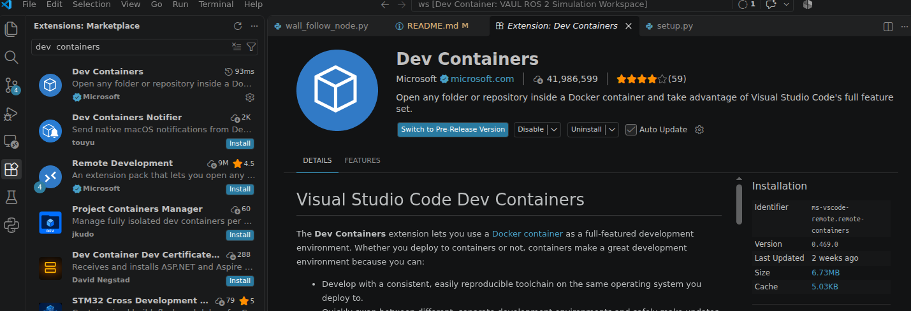
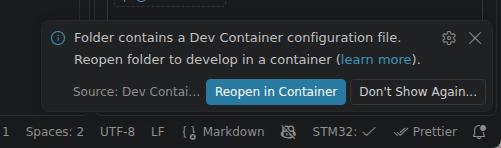
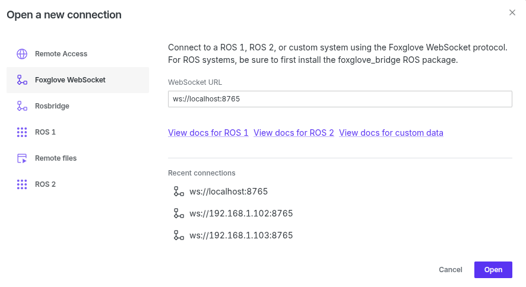
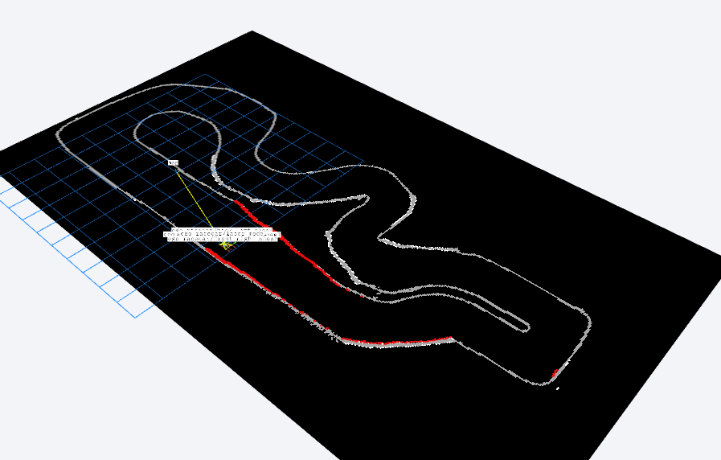

# Reactive Control

Instructions for running the wall-following simulator in a development container.

## Prerequisites

- [Docker Desktop](https://www.docker.com/products/docker-desktop/)
- [Visual Studio Code](https://code.visualstudio.com/)
- The [Dev Containers extension](https://marketplace.visualstudio.com/items?itemName=ms-vscode-remote.remote-containers) for VS Code



## 1. Open the project in a container

In VS Code, click **Reopen in Container**.



If the button does not appear:

1. Press `Ctrl+Shift+P`.
2. Type `Dev Containers: Open workspace in container`.
3. Select the command from the list.

## 2. Start the simulator

Open a terminal by pressing `Ctrl+Shift+Backtick` or clicking **Terminal**. Then run:

```bash
ros2 run reactive_control wall_follow_node
```

## 3. Visualize the simulation

Open [Foxglove Studio](https://foxglove.dev/), then create a WebSocket connection on port `8765`.

You can also download the Foxglove app from the [download page](https://foxglove.dev/download).



Expected result:



## 4. Modify the algorithm

Open [`wall_follow_node.py`](src/reactive_control/reactive_control/wall_follow_node.py).

Complete the functions, experiment with the parameters, and try to reduce the lap time.
